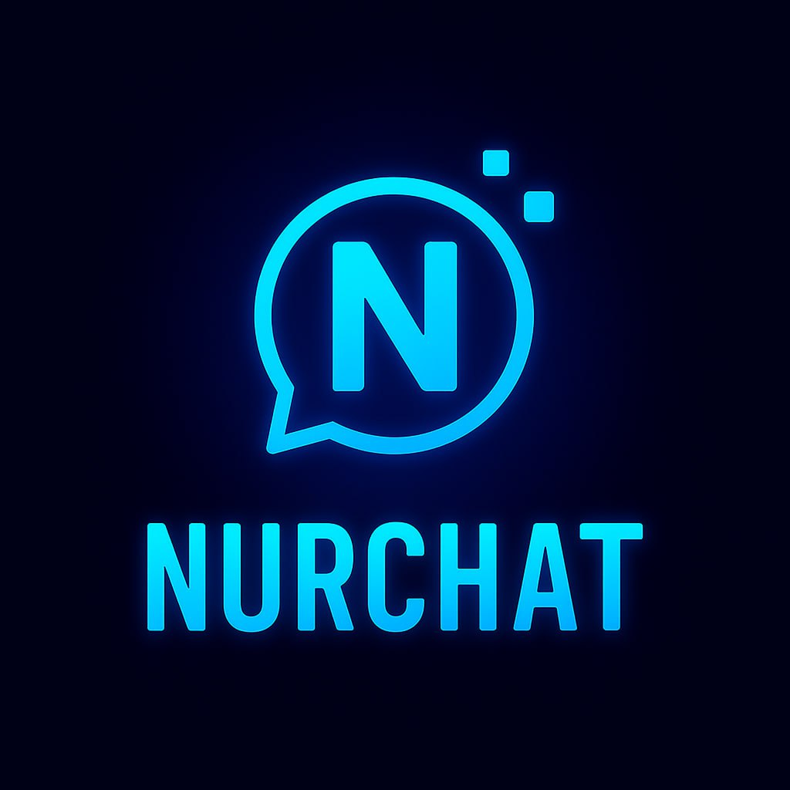

# NurChat — Анонимный Мессенджер с E2E Шифрованием



[](https://github.com/salihhhh014/NurChat_desktop_beta/actions/workflows/ci.yml)

NurChat — современный анонимный мессенджер с end-to-end шифрованием. Проект [NurApps](https://t.me/NurApps) — исламский стартап.

> **Статус:** Сейчас доступен только десктоп (Windows, macOS, Linux). Мобильная версия (Android + iOS) в разработке — скоро!

## Возможности

- **Анонимность** — регистрация без телефона/email, только никнейм
- **E2E шифрование** — X25519 DH + SecretBox (XSalsa20-Poly1305), подписи Ed25519
- **Групповые чаты** — создание групп, управление участниками
- **Голосовые и видеозвонки** — WebRTC P2P (экспериментально)
- **Медиа** — изображения, видео, голосовые сообщения, документы
- **P2P/IPFS** — децентрализованное хранение (экспериментально)
- **Реакции** — emoji-реакции на сообщения
- **Пересылка** — пересылка сообщений между чатами
- **Редактирование** — inline-редактирование отправленных сообщений
- **Удаление** — удаление у себя / у всех
- **Поиск** — поиск по сообщениям
- **Темы** — светлая/тёмная тема

## Технологический стек

| Компонент | Технологии |
|-----------|-----------|
| Фронтенд | React 19, TypeScript, Vite 8 |
| Нативный слой | Tauri v2 (Rust) |
| Бэкенд | FastAPI, SQLAlchemy, SQLite |
| Шифрование | PyNaCl, tweetnacl (X25519, Ed25519, SecretBox) |
| WebSocket | websockets |
| Сборка | npm (фронт), uv (Python) |

## Установка

### Требования
- Node.js 22+
- Python 3.12+
- [uv](https://docs.astral.sh/uv/) (package manager для Python)
- Rust + Cargo (для Tauri)

### Быстрый запуск
```bash
git clone https://github.com/your-username/NurChat_desktop.git
cd NurChat_desktop

# Python зависимости
uv venv
uv pip install -r requirements.txt

# Frontend зависимости
cd frontend
npm install
cd ..

# Запуск (сервер + Tauri)
start.bat
```

### Ручной запуск
```bash
# Сервер
.venv\Scripts\python -m uvicorn server.main:app --host 0.0.0.0 --port 8000 --reload

# Tauri (в отдельном терминале)
cd frontend
npx tauri dev
```

## Конфигурация

Создайте `.env` в корне проекта (см. `.env.example`):

```env
SERVER_HOST=0.0.0.0
SERVER_PORT=8000
DEBUG=True
DATABASE_URL=sqlite:///./nurchat.db
ENCRYPTION_KEY=
```

## Тестирование

```bash
# E2E шифрование (не требует сервер)
pytest test/test_crypto.py -v

# Функциональные тесты (требует запущенный сервер)
python test/functional_tests.py
```

## Структура проекта

```
NurChat_desktop/
├── frontend/               # React + TypeScript (Vite)
│   ├── src/
│   │   ├── pages/          # Страницы (Chat, Login, Profile, Settings, Call, Legal)
│   │   ├── components/     # Компоненты (MessageBubble, EmojiPicker, UserProfileModal...)
│   │   ├── services/       # API клиент, WebSocket, E2E, P2P
│   │   └── hooks/          # React хуки (useAvatar)
│   └── src-tauri/          # Tauri (Rust) конфиг
├── server/                 # FastAPI сервер
│   ├── routes/             # API маршруты (auth, chat, files, calls, p2p, forward, legal)
│   ├── core/               # Ядро (models, security, storage, ipfs_client)
│   └── ws/                 # WebSocket (chat_manager, signaling)
├── shared/                 # Общие модули (config, schemas, p2p_encryption)
├── legal/                  # Юридические документы
├── media/                  # Хранилище медиа-файлов
└── test/                   # Тесты
```

## Roadmap

- [x] Десктопное приложение (Tauri v2)
- [x] E2E шифрование (X25519 + SecretBox)
- [x] Групповые чаты
- [x] Голосовые/видеозвонки (WebRTC)
- [x] P2P/IPFS интеграция
- [ ] **Мобильная версия (Android + iOS)**
- [ ] Синхронизация устройств
- [ ] Стикеры и GIF

## Лицензия

GNU AGPL v3.0 — см. [LICENSE](LICENSE)
